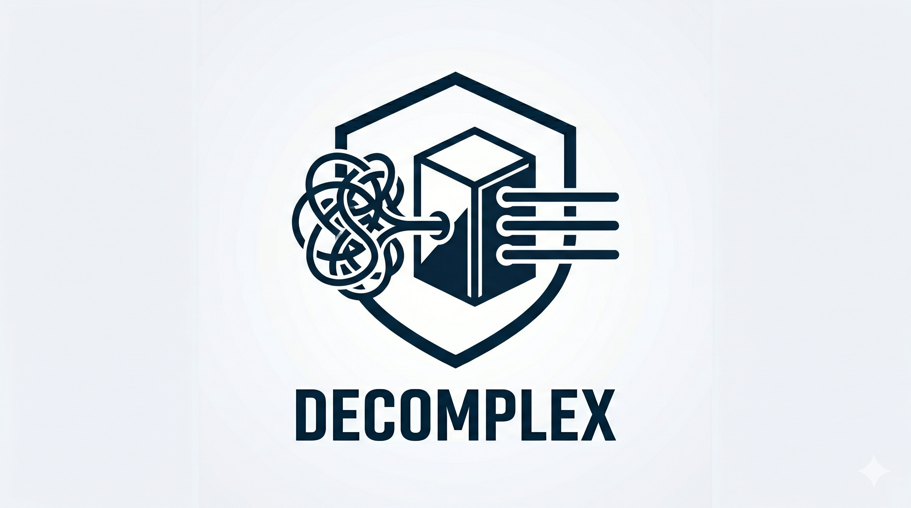

# Decomplex



Decomplex is a set of metrics that help identify complex code and ways
to mitigate it. It is used in the development of the CLEAR compiler and
runtime to have LLMs write quality code at scale with high velocity.

- See [What Is Complexity Anyway?](https://cuzzo.github.io/clear/blog/what-even-is-complexity-anyway/)
  for a deeper understanding of what complexity is, and how Decomplex
  helps you identify and eliminate it.
- See [Metrics Expo](docs/agents/metrics-expo.md) for concrete examples
  of what Decomplex measures.

## Getting Started

If you want to contribute, see [CONTRIBUTING.md](CONTRIBUTING.md).

### Prerequisites

- Ruby 3.x
- Bundler
- Tree-sitter grammars for any language you want to analyze

From this repository:

```bash
bundle exec gems/decomplex/exe/decomplex report src --output=gems/decomplex/report.md
```

For a narrower run:

```bash
bundle exec gems/decomplex/exe/decomplex report src/annotator src/ast/type.rb --output=/tmp/decomplex.md
```

For one targeted metric:

```bash
bundle exec gems/decomplex/exe/decomplex wicc src --output=/tmp/wicc.md
bundle exec gems/decomplex/exe/decomplex locality-drag src --output=/tmp/locality-drag.md
bundle exec gems/decomplex/exe/decomplex implicit-control-flow src --output=/tmp/icf.md
```

## Outputs

### Markdown Report

The main output is a Markdown report:

```bash
bundle exec gems/decomplex/exe/decomplex report src --output=report.md
```

The report opens with cross-detector convergence and root-cause
clusters, then lists each detector section by signal tier. See
[report.md](report.md) for a generated example over CLEAR.

CLEAR uses [Lineage](../lineage/README.md) to review code at scale.
Lineage includes an experimental local UI that you can run on localhost
to inspect source, coverage, mutation evidence, systems hazards, and
quality-tool output together.

### Baseline And Delta

Decomplex can emit a JSON snapshot for later comparison:

```bash
bundle exec gems/decomplex/exe/decomplex report src \
  --output=report.md \
  --emit-json=tmp/decomplex-baseline.json
```

Then compare a later run:

```bash
bundle exec gems/decomplex/exe/decomplex delta tmp/decomplex-baseline.json src
```

The delta path is intended for CI ratchets and PR review: line-only
movement is treated as persisted instead of new debt.

### SARIF

Decomplex can generate SARIF 2.1.0 for GitHub code scanning:

```bash
bundle exec gems/decomplex/exe/decomplex report src \
  --output=report.md \
  --sarif=tmp/decomplex.sarif
```

SARIF is generated from the same structured report findings used by
Markdown and delta, so downstream tools do not re-run or re-derive
detectors.

### CI Integration

The current CI-ready path is:

1. generate a Markdown report artifact;
2. generate a JSON baseline snapshot;
3. run `decomplex delta` on PRs;
4. fail or warn only on new/growing high-confidence findings.

GitHub Actions can upload the generated SARIF with
`github/codeql-action/upload-sarif`. The generalized gem SARIF workflow
is implemented in the
[`generalized-gems-sarif` CI job](https://github.com/cuzzo/clear/blob/lineage-complexity-ui/.github/workflows/ci.yml#:~:text=generalized-gems-sarif%3A).

## Supported Languages Roadmap

Decomplex uses a normalized Tree-sitter syntax facade. Parser support is
not the same thing as equal metric quality: Ruby has the strongest
dogfood coverage today, while other languages are still experimental.

- [x] Ruby: fully supported.
- [ ] Python: experimentally supported.
- [ ] JavaScript: experimentally supported.
- [ ] TypeScript: experimentally supported.
- [ ] Go: experimentally supported.
- [ ] Rust: experimentally supported.
- [ ] Zig: experimentally supported.

## Boundaries

Decomplex does not:

- rewrite code;
- prove that a finding is a bug;
- perform whole-program CFG or pointer-alias analysis;
- infer types or nilability;
- replace mutation, fuzz, coverage, or type checks.

It ranks likely review targets. A good finding should make a human say:
"this is where the design pressure is coming from."

Decomplex does not detect lint issues or code smells, as packages for
that already exist in every language.

## Links

- [Metrics expo](docs/agents/metrics-expo.md)
- [Design notes](docs/agents/design.md)
- [Cross-language notes](docs/agents/cross-language.md)
- [False simplicity](docs/agents/false-simplicity.md)
- [Generated CLEAR report](report.md)
