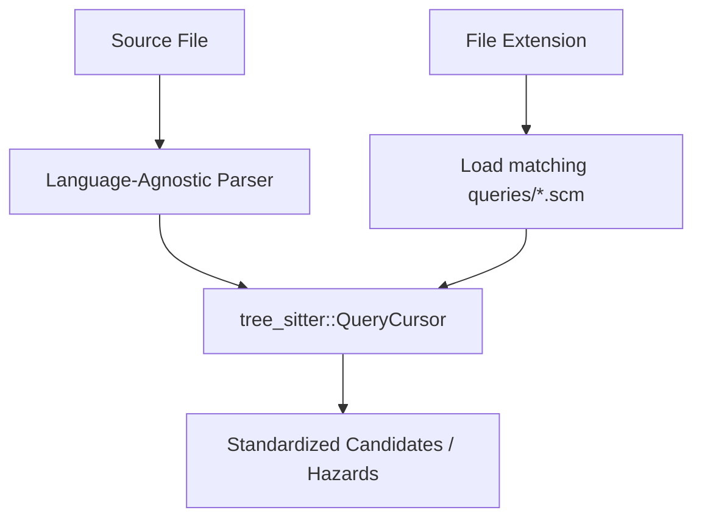

# Refactoring Language-Specific Extraction with Tree-Sitter Tag Queries

This document outlines how the language-specific logical unit extraction and hazard scanning within `gems/lineage` can be refactored into a language-agnostic query engine using Tree-Sitter declarative query files (`.scm`).

---

## Language-Agnostic Engine Architecture

### Is it language-agnostic by default?
- **The Core Rust Engine**: Yes. The Rust code in [extract.rs](file:///home/yahn/litedb/gems/lineage/src/db/extract.rs) and [hazard.rs](file:///home/yahn/litedb/gems/lineage/src/db/hazard.rs) becomes entirely language-agnostic. It will only handle file loading, tree-sitter parsing, query execution, and database mapping.
- **The Query Assets**: No. We must author and maintain **one query file (`.scm`) per language** (e.g., `queries/python/tags.scm`, `queries/go/tags.scm`). This is standard for Tree-Sitter integrations (used by GitHub, Sourcegraph, and Neovim) because AST node structures differ across languages.



---

## Current Language-Specific Code Locations

### 1. Logical Unit Extraction
In [extract.rs](file:///home/yahn/litedb/gems/lineage/src/db/extract.rs), logical units are extracted by traversing the AST and matching on concrete node kinds in language-specific functions:
- [ruby_candidate_for_node](file:///home/yahn/litedb/gems/lineage/src/db/extract.rs#L389)
- [python_candidate_for_node](file:///home/yahn/litedb/gems/lineage/src/db/extract.rs#L423)
- [javascript_candidate_for_node](file:///home/yahn/litedb/gems/lineage/src/db/extract.rs#L452)
- [typescript_candidate_for_node](file:///home/yahn/litedb/gems/lineage/src/db/extract.rs#L471)
- [go_candidate_for_node](file:///home/yahn/litedb/gems/lineage/src/db/extract.rs#L494)
- [c_candidate_for_node](file:///home/yahn/litedb/gems/lineage/src/db/extract.rs#L521)
- [cpp_candidate_for_node](file:///home/yahn/litedb/gems/lineage/src/db/extract.rs#L533)
- [csharp_candidate_for_node](file:///home/yahn/litedb/gems/lineage/src/db/extract.rs#L554)
- [rust_candidate_for_node](file:///home/yahn/litedb/gems/lineage/src/db/extract.rs#L586)
- [zig_candidate_for_node](file:///home/yahn/litedb/gems/lineage/src/db/extract.rs#L610)

### 2. Hazard Scanning
In [hazard.rs](file:///home/yahn/litedb/gems/lineage/src/db/hazard.rs), hazards are detected using line-level substring or regex searches on file contents:
- [scan_zig_sites](file:///home/yahn/litedb/gems/lineage/src/db/hazard.rs#L347)
- [scan_go_sites](file:///home/yahn/litedb/gems/lineage/src/db/hazard.rs#L406)
- [scan_rust_sites](file:///home/yahn/litedb/gems/lineage/src/db/hazard.rs#L434)
- [scan_c_sites](file:///home/yahn/litedb/gems/lineage/src/db/hazard.rs#L468)
- [scan_cpp_sites](file:///home/yahn/litedb/gems/lineage/src/db/hazard.rs#L499)
- [scan_csharp_sites](file:///home/yahn/litedb/gems/lineage/src/db/hazard.rs#L530)

---

## Replacing Logical Unit Extraction

### Refactoring `extract.rs`
The engine compiles a unified query using standard captures:
- `@definition.class`: Identifies a class unit.
- `@definition.function`: Identifies a function unit.
- `@definition.interface`: Identifies an interface unit.
- `@definition.module`: Identifies a module unit.
- `@name`: Identifies the node holding the name of the definition.

#### Declarative Tag Query Examples

##### Python (`queries/python/tags.scm`)
```query
(class_definition
  name: (identifier) @name) @definition.class

(function_definition
  name: (identifier) @name) @definition.function

(type_alias_statement
  left: (type_list (identifier) @name)) @definition.class
```

##### Rust (`queries/rust/tags.scm`)
```query
(struct_item
  name: (type_identifier) @name) @definition.class

(function_item
  name: (identifier) @name) @definition.function

(impl_item
  type: (type_identifier) @name) @definition.class
```

#### Agnostic Rust Engine Implementation
```rust
pub fn extract_units_agnostic(
    language: tree_sitter::Language,
    query_str: &str,
    source: &str,
) -> Vec<LogicalUnit> {
    let mut parser = Parser::new();
    parser.set_language(&language).unwrap();
    let tree = parser.parse(source, None).unwrap();
    let query = Query::new(&language, query_str).unwrap();
    let mut cursor = QueryCursor::new();
    
    let mut units = Vec::new();
    for m in cursor.matches(&query, tree.root_node(), source.as_bytes()) {
        let mut kind = UnitKind::Function;
        let mut name = String::new();
        let mut node = None;

        for capture in m.captures {
            let capture_name = query.capture_names()[capture.index as usize];
            match capture_name {
                "definition.class" => {
                    kind = UnitKind::Class;
                    node = Some(capture.node);
                }
                "definition.function" => {
                    kind = UnitKind::Function;
                    node = Some(capture.node);
                }
                "name" => {
                    name = capture.node.utf8_text(source.as_bytes()).unwrap().to_string();
                }
                _ => {}
            }
        }

        if let (Some(n), false) = (node, name.is_empty()) {
            units.push(LogicalUnit {
                name,
                kind,
                line: (n.start_position().row + 1) as u32,
                // ...
            });
        }
    }
    units
}
```

---

## Replacing Hazard Scanning

Replacing fragile line-by-line checks with AST queries solves layout/formatting bugs (e.g. goroutines formatted on the same line as braces).

### Declarative Hazard Query Examples

##### Go Hazards (`queries/go/hazards.scm`)
```query
;; Match goroutine invocations directly in the AST
(go_statement) @hazard.go_race_goroutine

;; Match channel creations and operations
(send_statement) @hazard.go_concurrency_channel
(receive_expression) @hazard.go_concurrency_channel

;; Match sync operations (Mutex, WaitGroup)
(call_expression
  function: (selector_expression
    operand: (identifier) @obj
    field: (field_identifier) @method)
  (#match? @obj "^(sync|Mutex|RWMutex|WaitGroup)$")) @hazard.go_concurrency_sync
```

##### Rust Hazards (`queries/rust/hazards.scm`)
```query
;; Match unsafe blocks
(unsafe_block) @hazard.rust_unsafe_block

;; Match unsafe functions/impls
(function_item
  (visibility_modifier)?
  "unsafe") @hazard.rust_unsafe_fn

;; Match raw pointer dereferences
(unary_expression
  operator: "*"
  expr: (identifier)) @hazard.rust_unsafe_operation
```
