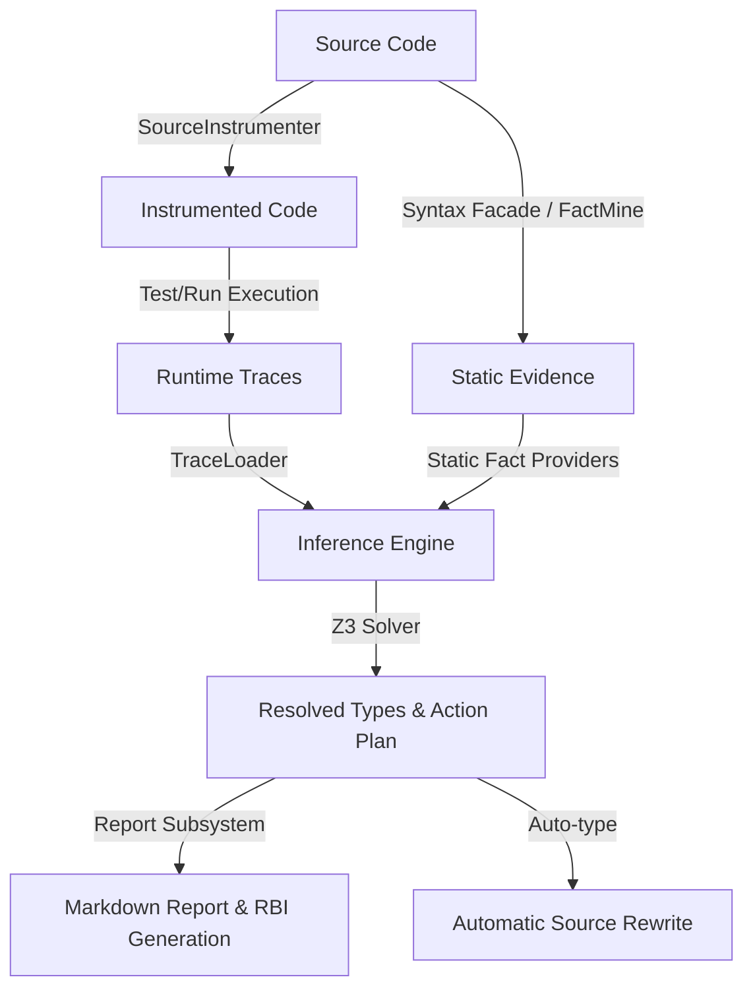

# Nil-kill: Current Architecture Specification

This document details the architecture, data flow, and boundaries of the `nil-kill` codebase as of the current implementation.

## Overview

Nil-kill is a hybrid static and dynamic type analysis tool designed to identify and rank "type pressure" (unnecessary nil-guards, union type ambiguity, and ad-hoc container schemas) within dynamic codebases. It is structured around a three-step pipeline: **Collect**, **Infer**, and **Report**.

---

## Core Subsystems

### 1. Command Line Interface & Orchestration (`lib/nil_kill/cli.rb`)
The entry point is `NilKill::CLI`. It coordinates the self-healing process (`NilKill.ensure_src_restored!`) to prevent crash-tainted instrumented files from corrupting subsequent runs. It routes execution to specific subcommand handlers:
- `collect`: Traces dynamic type execution.
- `infer`: Runs static analysis and solver-based type inference.
- `report`: Synthesizes dynamic and static evidence into a prioritize-by-pressure report.

### 2. Syntax Facade (`lib/nil_kill/syntax.rb`)
Provides a Tree-sitter-backed parsing wrapper specifically for Ruby. It uses `espalier/tree_sitter` to parse files and wraps the raw syntax nodes in specialized subclass objects (e.g., `CallNode`, `DefNode`, `ClassNode`, `StatementsNode`). 
- **Role**: Emulates a parser-level AST API so other parts of the static analysis can traverse node structures in Ruby.
- **Limitation**: The syntax classes and node matches are highly coupled to Ruby grammar structures, complicating multi-language generalizations despite referencing Tree-sitter.

### 3. Runtime Collection & Instrumentation (`lib/nil_kill/source_instrumenter.rb`, `lib/nil_kill/runtime_trace.rb`)
Handles dynamic type observations by modifying target source code in-place.
- **SourceInstrumenter**: Injects tracing calls (`NilKillRuntimeTrace.record_*`) into function entry, returns, assignments, and class instantiations.
- **NilKillRuntimeTrace**: Acts as the runtime listener. It records variable, method-parameter, and return types, writing results to `tmp/nil-kill/runtime/` as JSON files. It contains complex thread-safe tallies (`NKTally`, `NKSet`), object finalizers, and stack frame tracking.

### 4. Static Fact Indexing (`lib/nil_kill/static_analysis.rb`, `lib/nil_kill/static_evidence.rb`)
Extracts structural facts from the codebase.
- **StaticEvidence**: Delegates to `Espalier::StaticEvidence.build`, which runs the native `fact-mine-rust` binary to generate a JSON file containing structural information (calls, definitions, assignments, etc.).
- **StaticAnalysis / Store**: Parses the generated facts and overlays local language capabilities.

### 5. Inference Engine (`lib/nil_kill/infer.rb`, `lib/nil_kill/z3_solver.rb`)
Combines static facts and runtime traces to infer type profiles.
- **Infer**: Re-traverses the codebase (using `nil_kill/syntax.rb`) to identify return origins, parameter origins, and container index lookups.
- **Z3Solver**: Translates type propagation constraints into SMT-LIB equations and solves them using the Z3 solver. It determines whether a slot can be narrowed to a concrete type without type errors.

### 6. Reporting & Actions (`lib/nil_kill/report.rb`)
Constructs the final report and action plan.
- **Report**: A massive class that aggregates resolved types, ranks them by "pressure" (the number of downstream guard sites or type conversions influenced by the slot), and formats the output.
- **StructRBI / RBI Return Index**: Auto-generates RBI files (`T::Struct` signatures) representing reconstructed hash structures.
