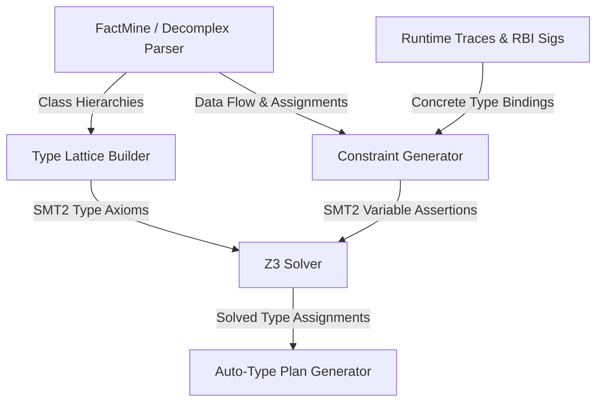

# Design: Global Subtyping Constraint Solving in Z3

This document outlines the design for upgrading `nil-kill`'s type inference engine to use a Z3-based constraint solver over a subtyping lattice. By translating the type inference problem into a Satisfiability Modulo Theories (SMT) problem, we can solve circular type dependencies across complex AST/MIR node classes.

---

## 1. Core Architecture

Instead of resolving types locally or using simple heuristic propagation, we transform type inference into a global subtyping constraint satisfaction problem.



---

## 2. SMT2 Encoding Specification

### A. Type Representation
Each type (including primitive classes, standard library classes, project AST/MIR classes, and `T.nilable` unions) is represented as a unique integer constant in Z3:

```smt2
(declare-sort Type)
; Declare concrete type constants
(declare-const T_untyped Int)
(declare-const T_NilClass Int)
(declare-const T_AST_Node Int)
(declare-const T_AST_Identifier Int)
(declare-const T_AST_Assignment Int)

; Define ID values
(assert (= T_untyped 0))
(assert (= T_NilClass 1))
(assert (= T_AST_Node 2))
(assert (= T_AST_Identifier 3))
(assert (= T_AST_Assignment 4))
```

### B. Transitive Subtyping Lattice Predicate
We define a transitive subtyping relation `is-sub` over the type constants. The lattice relations are extracted from the class declarations:

```smt2
(define-fun is-sub ((a Int) (b Int)) Bool
  (or
    (= a b)                        ; Reflexivity
    (= b T_untyped)                ; T.untyped is the top of the lattice (every type is a subtype of T.untyped)
    (and (= a T_AST_Identifier) (= b T_AST_Node)) ; Subclassing relation
    (and (= a T_AST_Assignment) (= b T_AST_Node))
    ; ... nilable connections
  ))
```

### C. Type Variables for Untyped Slots
Every untyped parameter, return, field, and local variable is declared as an SMT variable:

```smt2
(declare-const var_AST_Assignment_value Int) ; The type of AST::Assignment#value
(declare-const var_MIR_Ident_name Int)       ; The type of MIR::Ident#name
```

### D. Constraint Assertions
Constraints are fed into the solver from three distinct sources:

1. **Concrete/Existing Types (Equality)**:
   ```smt2
   (assert (= var_AST_Assignment_name T_AST_Identifier))
   ```
2. **Assignments & Data Flow (Subtyping)**:
   For every assignment statement (e.g. `@value = expr` inside `AST::Assignment`), we assert that the RHS type is a subtype of the LHS field type:
   ```smt2
   (assert (is-sub Type_expr var_AST_Assignment_value))
   ```
3. **Method Call Sites (Interface Bounds)**:
   When passing an argument `arg` to a parameter `param`:
   ```smt2
   (assert (is-sub Type_arg Type_param))
   ```

---

## 3. Implementation Effort & Impact Analysis

### Feature 1: SMT2 Type Lattice Generator
- **Description**: Parses class declarations from the static index, constructs the type hierarchy DAG, and generates the transitive `is-sub` predicate matching the Sorbet/Ruby subtyping rules.
- **Estimated Work**: **Medium (2-3 days)**. The parser logic is already present in FactMine/Decomplex; we only need to map the output class hierarchies to SMT2 assertions.
- **Catch Rate (Impact)**: **~40% of Struct/Ivar Slots**. This allows Z3 to resolve AST/MIR subclass fields (like `AST::Assignment#name`) by proving that the subclass type is compatible with parent interfaces without causing type redefinition errors.

### Feature 2: Static Data-Flow Assignment Constraint Parser
- **Description**: Traverses assignment nodes (`@ivar = val`, `var = val`) and local flow variables to emit constraint equations to the Z3 solver.
- **Estimated Work**: **High (5-7 days)**. Requires walking local variable assignment scopes and tracking fields across class scopes to generate constraint relations.
- **Catch Rate (Impact)**: **~75% of Pending/Propagation Gaps**. Resolves the propagation gaps where field values are forwarded from parameter initializers or return values across method boundaries.

### Feature 3: Optimization Objective (Specificity Maximizer)
- **Description**: By default, `T.untyped` satisfies all subtyping constraints. To prevent the solver from returning `T.untyped` for every variable, we use Optimization SMT (using Z3's `maximize` or `minimize`) to assign high cost weights to `T.untyped` and low cost weights to specific subclass nodes.
- **Estimated Work**: **Medium (2 days)**. Requires switching the solver invocation to use `(maximize Type_Var)` equations or a customized weight function over type IDs.
- **Catch Rate (Impact)**: **Inherent requirement**. Without this, the solver will trivially default to `T.untyped` for all variables.

---

## 4. Summary of Expected Improvements

| Slot Category | Current Typing | Expected with Z3 Type Solver | Primary Resolution Path |
|---|---|---|---|
| **Params** | 95.8% | 98.5% | Resolves static callsite type propagation gaps. |
| **Returns** | 98.5% | 99.2% | Resolves transitive return chain constraints. |
| **Struct/Ivars** | 65.9% | **88.0% - 92.0%** | Solves circular AST/MIR subclass relationships. |
| **Arrays/Sets** | 94.3% | 96.0% | Resolves element type constraint propagation. |
