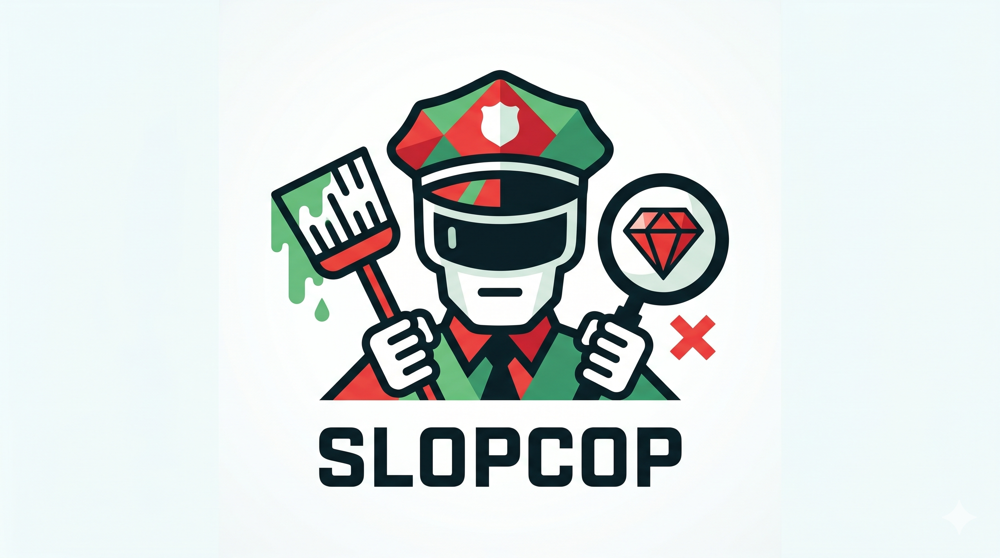

# SlopCop



Typical Code Coverage UIs only show you that a line was hit. That means
little, as only parts of a line may have been hit or tested. SlopCop
gives you two unique insights:

1. Is a line fully covered or only partially covered?
2. Is it part of a historically buggy line or method?

It is used by the CLEAR compiler to help focus attention on fixing the
buggiest parts of the codebase and putting the most care into review for
those parts as well.

## Getting Started

If you want to contribute, see [CONTRIBUTING.md](CONTRIBUTING.md).

### Prerequisites

- Ruby 3.x
- Bundler
- A git repository, so Boobytrap churn ranking can be applied
- A supported branch coverage artifact

From this repository:

```bash
bundle exec gems/slopcop/exe/slopcop report \
  --repo=. \
  --coverage=coverage/.resultset.json \
  --output=gems/slopcop/report.md \
  --json=/tmp/slopcop.json
```

For a narrower run:

```bash
bundle exec gems/slopcop/exe/slopcop report \
  --repo=. \
  --coverage=coverage/.resultset.json \
  --files=src/annotator/annotator.rb,src/ast/type.rb \
  --output=/tmp/slopcop.md
```

For Lineage source overlays:

```bash
bundle exec gems/slopcop/exe/slopcop dark-arms \
  --repo=. \
  --coverage=coverage/.resultset.json \
  --json=/tmp/slopcop-dark-arms.json
```

## Outputs

SlopCop can output a Markdown report for human review, JSON for tools
and LLMs, SARIF for GitHub code scanning, Lineage-ready dark-arm
overlays, and SARIF/JSON/Markdown constraint reports for CI hazard
checks.

> [!NOTE]
> SlopCop also integrates with [Lineage](../lineage/README.md),
> CLEAR's experimental UI to review LLM-assisted code at scale.

### Markdown Report

The main output is a Markdown report:

```bash
bundle exec gems/slopcop/exe/slopcop report \
  --repo=. \
  --coverage=coverage/.resultset.json \
  --output=report.md
```

The report opens with **Top True Gaps**: reachable, genuine uncovered
branch arms ranked by file churn and Decomplex structural risk. The
category summary explains why the other dark arms are not the highest
return test targets.

### JSON

Use `--json` with `report` when another tool or an LLM should consume
the ranked gaps:

```bash
bundle exec gems/slopcop/exe/slopcop report \
  --repo=. \
  --coverage=coverage/.resultset.json \
  --json=/tmp/slopcop.json
```

### SARIF

SlopCop can generate SARIF 2.1.0 for GitHub code scanning:

```bash
bundle exec gems/slopcop/exe/slopcop report \
  --repo=. \
  --coverage=coverage/.resultset.json \
  --output=report.md \
  --json=/tmp/slopcop.json \
  --sarif=/tmp/slopcop.sarif
```

SARIF is generated from the same ranked genuine gaps used by Markdown
and JSON output. It does not emit every dark arm; code scanning should
surface actionable test gaps, not category noise.

### Lineage Overlay

`dark-arms` emits every classified dark arm without running the ranked
report pass:

```bash
bundle exec gems/slopcop/exe/slopcop dark-arms \
  --repo=. \
  --coverage=coverage/.resultset.json \
  --json=/tmp/slopcop-dark-arms.json
```

This is the format Lineage uses for gutter and source overlays.

### Constraint Reports

`constraints` checks changed files against named coverage constraints,
currently used by CLEAR for Loom and VOPR hazard coverage:

```bash
bundle exec gems/slopcop/exe/slopcop constraints \
  --repo=. \
  --base=origin/master \
  --coverage=loom:zig/zig-out/coverage-loom/merged/kcov-merged/cobertura.xml \
  --coverage=vopr:zig/zig-out/coverage-vopr/merged/kcov-merged/cobertura.xml \
  --markdown=/tmp/slopcop-constraints.md \
  --json=/tmp/slopcop-constraints.json \
  --sarif=/tmp/slopcop-constraints.sarif
```

Findings are advisory unless `--strict` is supplied.

## CI Integration

The current CI-ready path is:

1. produce branch coverage for the code under test;
2. run `slopcop report` to generate Markdown, JSON, and SARIF artifacts;
3. optionally run `slopcop dark-arms` for Lineage overlays;
4. optionally run `slopcop constraints` for hazard-specific coverage
   checks;
5. upload report SARIF with `github/codeql-action/upload-sarif`;
6. fail or warn only on genuine gaps or strict constraint violations.

> [!NOTE]
> See
> [CLEAR's GitHub Config](https://github.com/cuzzo/clear/blob/decomplex-launch/.github/workflows/ci.yml#:~:text=slopcop-report-sarif%3A)
> for how to include SlopCop SARIF as a Pull Request review helper, or
> part of your Continuous Integration workflow. See
> [CI Gate Notes](docs/agents/ci-gate.md) for the planned pull request
> ratchet model.

## Coverage Inputs

SlopCop accepts Boobytrap-normalized coverage inputs, including:

- SimpleCov `.resultset.json`;
- kcov output directories;
- kcov Cobertura XML;
- kcov codecov JSON;
- coverage.py JSON;
- Nil-kill branch coverage JSON.

Project-specific external/boundary methods and diagnostic helpers are
caller-supplied through `--ffi` and `--diagnostic`; SlopCop does not
ship a CLEAR-specific lexicon.

## Supported Languages Roadmap

SlopCop relies on [Boobytrap](../boobytrap/README.md) for branch-arm
normalization and [Decomplex](../decomplex/README.md) language lexicons
for classifying type/null guards and diagnostic paths.
Ruby support has been battle tested to develop the CLEAR compiler. Zig
support is currently being used for CLEAR runtime hazard coverage. Other
languages are currently experimental.

- [x] Ruby: fully supported.
- [ ] Python: experimentally supported.
- [ ] JavaScript: experimentally supported.
- [ ] TypeScript: experimentally supported.
- [ ] Go: experimentally supported.
- [ ] Rust: experimentally supported.
- [ ] Zig: experimentally supported.

## Boundaries

SlopCop does not:

- collect coverage;
- compute churn itself;
- re-derive Decomplex structural findings;
- prove that an uncovered arm is a bug;
- post GitHub comments or call the GitHub API;
- replace mutation, fuzz, integration, or type checks.

It ranks likely test targets. A good finding should make a human say:
"this branch arm is reachable, meaningful, risky enough, and worth
testing next."

SlopCop does not detect lint issues or code smells, as packages for
that already exist in every language.

## Links

- [CLEAR compiler](../../README.md)
- [Decomplex](../decomplex/README.md): identifies complex state and
  control-flow pressure.
- [Boobytrap](../boobytrap/README.md): provides churn and risk signals.
- [Nil-kill](../nil-kill/README.md): traces nil and type pressure back
  to its source.
